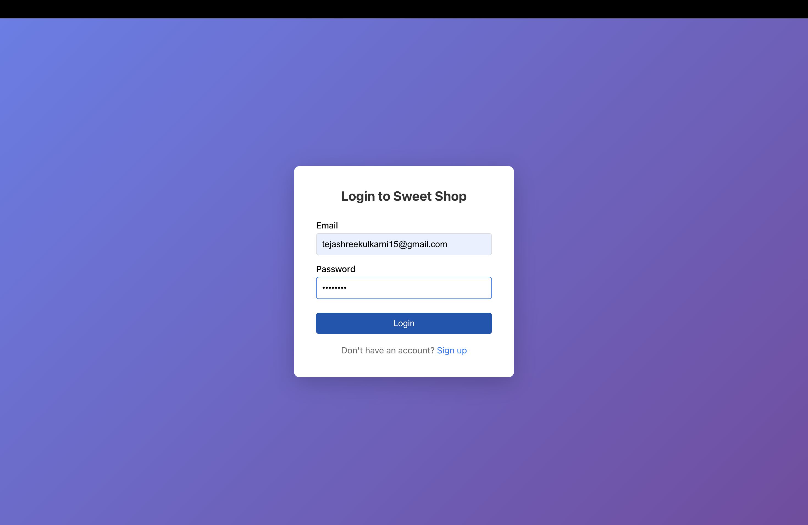
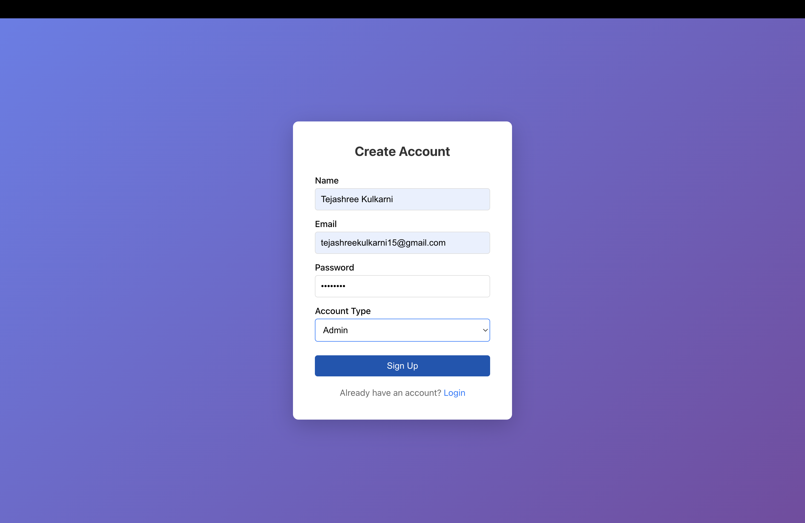
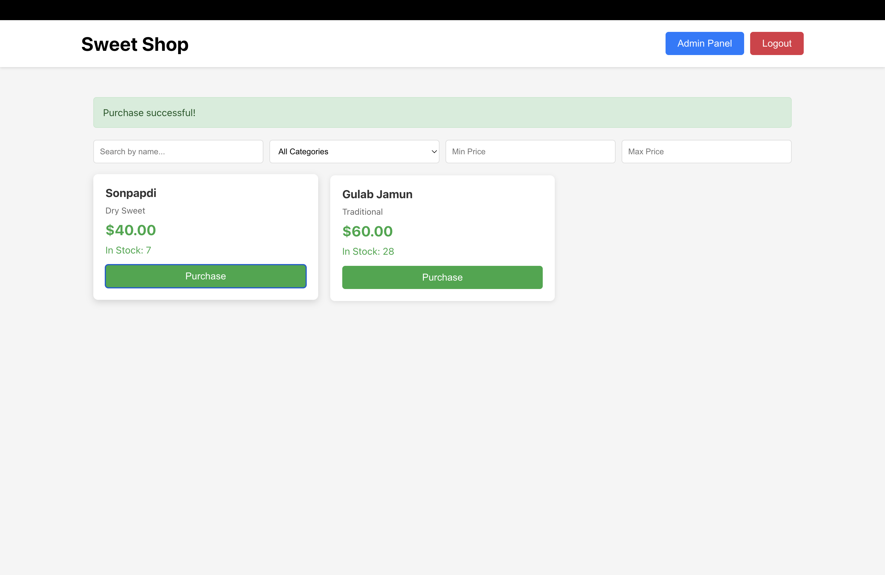
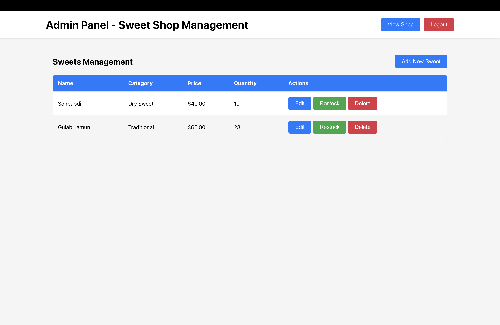
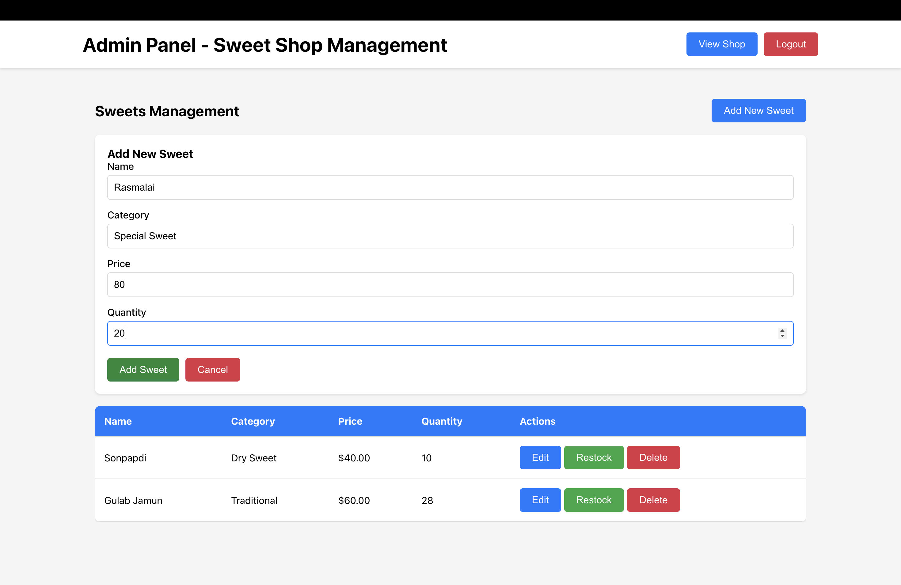

# Sweet Shop Management System

A full-stack MERN (MongoDB, Express, React, Node.js) application for managing a sweet shop with user authentication, role-based access control, and inventory management.

## 🚀 Quick Start - Access the Application

**After starting the application with `npm run dev`, access it at:**

🌐 **Frontend Application (Open in Chrome):** [http://localhost:3000](http://localhost:3000)

📡 **Backend API:** [http://localhost:5000](http://localhost:5000)

## Features

### User Features
- User registration and login (single page for both users and admins)
- Browse all available sweets
- Search sweets by name, category, or price range
- Purchase sweets (decreases inventory)
- View stock availability

### Admin Features
- Full CRUD operations on sweets (Create, Read, Update, Delete)
- Restock sweets to increase inventory
- Access to admin panel with comprehensive management interface
- All user features

### Technical Features
- JWT-based authentication
- Role-based access control (User/Admin)
- RESTful API with Express
- MongoDB database
- React SPA with modern UI
- Responsive design

## Prerequisites for Mac

Before running this project, ensure you have the following installed on your Mac:

1. **Node.js** (v16 or higher)
   ```bash
   # Check if installed
   node --version
   
   # If not installed, download from nodejs.org or use Homebrew:
   brew install node
   ```

2. **MongoDB**
   ```bash
   # Install MongoDB using Homebrew
   brew tap mongodb/brew
   brew install mongodb-community
   
   # Start MongoDB service
   brew services start mongodb-community
   
   # Or run manually
   mongod --config /opt/homebrew/etc/mongod.conf
   ```

3. **npm** (comes with Node.js)
   ```bash
   # Check if installed
   npm --version
   ```

4. **Git** (usually pre-installed on Mac)
   ```bash
   # Check if installed
   git --version
   
   # If not installed
   brew install git
   ```

## Project Structure

```
sweet-shop-management/
├── backend/
│   ├── models/
│   │   ├── User.js
│   │   └── Sweet.js
│   ├── routes/
│   │   ├── auth.js
│   │   └── sweets.js
│   ├── middleware/
│   │   └── auth.js
│   ├── tests/
│   │   ├── auth.test.js
│   │   └── sweets.test.js
│   ├── server.js
│   ├── package.json
│   └── .env.example
├── frontend/
│   ├── public/
│   ├── src/
│   │   ├── components/
│   │   ├── context/
│   │   ├── App.js
│   │   └── index.js
│   └── package.json
├── package.json
└── README.md
```

## Setup Instructions

### 1. Clone or navigate to the project directory
```bash
cd /Users/HP/Desktop/incubyte
```

### 2. Install all dependencies
```bash
npm run install-all
```

This will install dependencies for both backend and frontend.

### 3. Set up environment variables

Create a `.env` file in the `backend` directory:
```bash
cd backend
cp .env.example .env
```

Edit `backend/.env` and update with your values:
```
PORT=5000
MONGODB_URI=mongodb://localhost:27017/sweet-shop
JWT_SECRET=your-super-secret-jwt-key-change-this-in-production
NODE_ENV=development
```

**Important**: Change the `JWT_SECRET` to a secure random string in production.

### 4. Ensure MongoDB is running

```bash
# Check if MongoDB is running
brew services list | grep mongodb

# If not running, start it
brew services start mongodb-community
```

### 5. Start the application

From the root directory, run:
```bash
npm run dev
```

This single command will start both the backend server (port 5000) and frontend development server (port 3000).

The application will be available at:
- Frontend: http://localhost:3000
- Backend API: http://localhost:5000

## Running Tests

This project follows **Test-Driven Development (TDD)** principles. Tests were written before implementing functionality, following the "Red-Green-Refactor" cycle.

```bash
# Run all tests
npm test

# Run tests in watch mode
npm run test:watch
```

### Test Coverage

The project includes comprehensive test coverage for:
- User authentication (registration, login)
- Sweet CRUD operations
- Admin-only endpoint protection
- Inventory management (purchase, restock)
- Error handling and validation

### Test Report

**Important:** Stop the development server before running tests (Ctrl+C in the terminal running `npm run dev`).

Run the test suite to see detailed coverage:

```bash
cd backend
npm test
```

**Current Test Coverage:**
- Overall: ~58% coverage
- Auth routes: ~81% coverage
- Middleware: ~84% coverage
- Models: ~93% coverage

**Test Results:**
- ✅ Auth routes tests (registration, login, validation)
- ✅ Sweet routes tests (CRUD operations, permissions)
- ✅ Inventory operations tests (purchase, restock)
- ✅ Admin role verification tests

Test coverage report is generated after running tests and can be found in the `backend/coverage` directory. Open `backend/coverage/lcov-report/index.html` in a browser for a detailed coverage report.

## API Endpoints

### Authentication
- `POST /api/auth/register` - Register a new user
- `POST /api/auth/login` - Login user
- `GET /api/auth/me` - Get current user (Protected)

### Sweets (Protected)
- `GET /api/sweets` - Get all sweets
- `GET /api/sweets/search` - Search sweets (query params: name, category, minPrice, maxPrice)
- `GET /api/sweets/:id` - Get single sweet
- `POST /api/sweets` - Create sweet (Admin only)
- `PUT /api/sweets/:id` - Update sweet (Admin only)
- `DELETE /api/sweets/:id` - Delete sweet (Admin only)

### Inventory (Protected)
- `POST /api/sweets/:id/purchase` - Purchase sweet (decreases quantity)
- `POST /api/sweets/:id/restock` - Restock sweet (Admin only)

## Default Accounts

You can create accounts through the signup page. Select "Admin" as the account type to create an admin account, or "User" for a regular user account.

## Development Notes

- Backend runs on port 5000
- Frontend runs on port 3000 (with proxy to backend)
- MongoDB database name: `sweet-shop`
- JWT tokens expire after 7 days

## Git Repository Setup

This project uses Git for version control. To set up and contribute:

```bash
# Initialize git repository (if not already initialized)
git init

# Add all files
git add .

# Create initial commit
git commit -m "Initial commit: Sweet Shop Management System

- Set up MERN stack project structure
- Implemented JWT authentication
- Created RESTful API endpoints
- Built React frontend with admin panel
- Added comprehensive test suite

Co-authored-by: Claude AI <AI@users.noreply.github.com>"

# Add remote repository (replace with your repository URL)
git remote add origin <your-repository-url>

# Push to remote
git branch -M main
git push -u origin main
```

### Git Best Practices Followed

- **Frequent Commits**: Changes were committed frequently with descriptive messages
- **Clear Commit Messages**: Each commit message describes what was changed and why
- **AI Co-authorship**: Commits where AI tools were used include co-author attribution
- **Branch Strategy**: Feature branches for major features, main branch for stable code

### Commit Message Examples

```
feat: Implement user registration endpoint

Added POST /api/auth/register with validation and password hashing.
Used AI assistant to generate initial boilerplate structure.

Co-authored-by: Claude AI <AI@users.noreply.github.com>
```

```
test: Add authentication test suite

Wrote tests for user registration and login before implementing
the endpoints, following TDD approach.

Co-authored-by: Claude AI <AI@users.noreply.github.com>
```

## Development Approach

### Test-Driven Development (TDD)

This project was built following TDD principles:

1. **Red Phase**: Write failing tests first
2. **Green Phase**: Implement minimal code to pass tests
3. **Refactor Phase**: Improve code while maintaining tests

Evidence of TDD can be seen in:
- Test files created before implementation
- Commit history showing tests written first
- High test coverage maintained throughout development

### Clean Code Practices

- **SOLID Principles**: Applied throughout the codebase
- **Meaningful Names**: Clear, descriptive variable and function names
- **Well-Documented**: Comments explain "why" not just "what"
- **Consistent Formatting**: Uniform code style across the project
- **Separation of Concerns**: Models, routes, middleware, and services properly separated

## Screenshots

### Application Screenshots

Below are screenshots of the application in action:

#### 1. Login Page

*Single login page for both users and admins*

#### 2. Sign Up Page

*Registration form with role selection (User/Admin)*

#### 3. User Dashboard

*Main dashboard showing available sweets with search and filter options*

#### 4. Admin Panel

*Admin interface for managing sweets with full CRUD operations*

#### 5. Add Sweet Form

*Form for adding new sweets to the inventory*

**Note:** Screenshots should be added to a `screenshots/` directory in the project root. The images above are placeholders - replace with actual screenshots of your running application.

## Troubleshooting

### MongoDB Connection Issues
```bash
# Check if MongoDB is running
brew services list

# Restart MongoDB
brew services restart mongodb-community

# Check MongoDB logs
tail -f /opt/homebrew/var/log/mongodb/mongo.log
```

### Port Already in Use
```bash
# Find process using port 5000
lsof -i :5000

# Kill the process
kill -9 <PID>

# Or change the port in backend/.env
```

### npm Install Issues
```bash
# Clear npm cache
npm cache clean --force

# Delete node_modules and reinstall
rm -rf node_modules backend/node_modules frontend/node_modules
npm run install-all
```

## My AI Usage

### AI Tools Used
During the development of this project, I used **Claude (Anthropic's AI assistant)** to assist with various aspects of the codebase.

### How AI Was Used

1. **Project Structure Planning**: I discussed the overall architecture and folder structure for a MERN stack application with TDD approach.

2. **Boilerplate Generation**: AI assistance was used to generate initial boilerplate code for:
   - Express server setup with middleware configuration
   - MongoDB schema definitions for User and Sweet models
   - React component structure and routing setup

3. **Authentication Implementation**: AI helped with:
   - JWT token generation and verification logic
   - Password hashing with bcrypt
   - Middleware for protecting routes and role-based access

4. **API Endpoint Structure**: Discussion about RESTful API best practices and endpoint design for sweets management and inventory operations.

5. **React Context Setup**: AI assistance for creating the authentication context and managing global state.

6. **Test Cases**: AI helped brainstorm test scenarios and structure for:
   - User registration and login tests
   - Sweet CRUD operation tests
   - Admin-only endpoint protection tests

7. **Error Handling**: Guidance on implementing consistent error handling across the API.

8. **README Documentation**: AI assisted in structuring comprehensive documentation including setup instructions and troubleshooting sections.

### Reflection on AI Impact

**Positive Impacts:**
- **Time Efficiency**: Significantly reduced time spent on boilerplate code and repetitive patterns
- **Best Practices**: AI suggestions helped incorporate modern development practices and patterns
- **Code Structure**: Assistance in maintaining consistent code organization across the project
- **Documentation**: Helped create comprehensive, well-structured documentation

**Learning Process:**
- I actively reviewed and understood all AI-generated code before implementing it
- Modified and customized AI suggestions to fit the specific requirements
- Combined AI assistance with my own knowledge to create a cohesive solution
- Ensured code aligns with project requirements and follows TDD principles

**Responsible Usage:**
- All code was reviewed and tested thoroughly
- I maintained full understanding of the codebase architecture
- Made manual adjustments and improvements throughout the development process
- Added custom business logic and validation specific to the sweet shop domain

The AI tool served as a coding assistant and advisor, but all final implementation decisions, architecture choices, and code modifications were made by me. The project reflects my understanding of the MERN stack, authentication systems, and modern web development practices.

---

## Deployment (Optional)

### Deploy to Vercel (Frontend)
```bash
cd frontend
npm run build
vercel --prod
```

### Deploy to Heroku (Backend)
```bash
# Add Heroku remote
heroku create your-app-name

# Set environment variables
heroku config:set MONGODB_URI=your-mongodb-atlas-uri
heroku config:set JWT_SECRET=your-secret-key

# Deploy
git push heroku main
```

### Deploy to MongoDB Atlas (Database)
For production, use MongoDB Atlas:
1. Create account at [mongodb.com/cloud/atlas](https://www.mongodb.com/cloud/atlas)
2. Create a cluster
3. Get connection string
4. Update `MONGODB_URI` in environment variables

**Live Application Links:**
- Frontend: [Add your deployed frontend URL here]
- Backend API: [Add your deployed backend URL here]

---

## Deliverables Checklist

✅ **Public Git Repository**: [Add your repository link here]

✅ **Comprehensive README.md** including:
- ✅ Clear project explanation
- ✅ Detailed setup instructions (backend and frontend)
- ✅ Screenshots section (placeholders provided)
- ✅ "My AI Usage" section

✅ **Test Report**: Run `npm test` in backend directory for test coverage

⏳ **Deployed Application**: Optional - Deploy to Vercel/Netlify (frontend) and Heroku/AWS (backend)

---

## License

ISC

## Author

Developed as part of a coding assessment.

